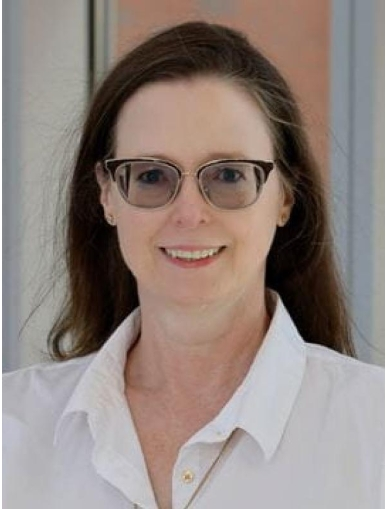
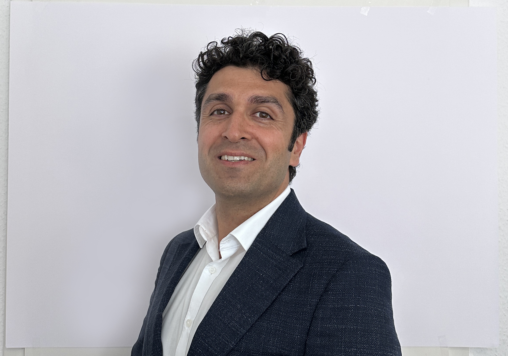
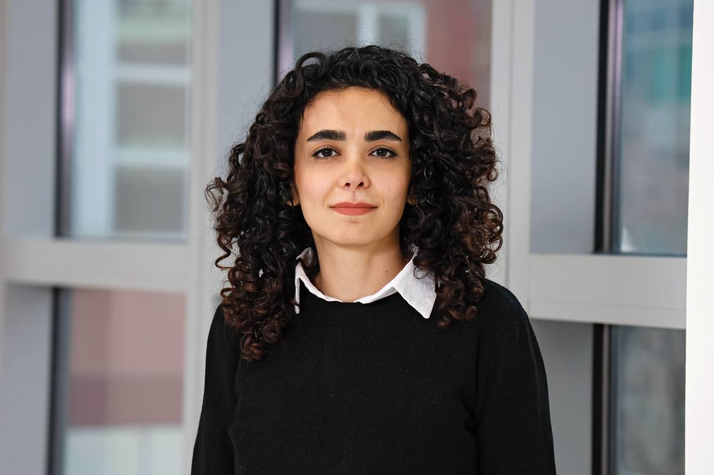
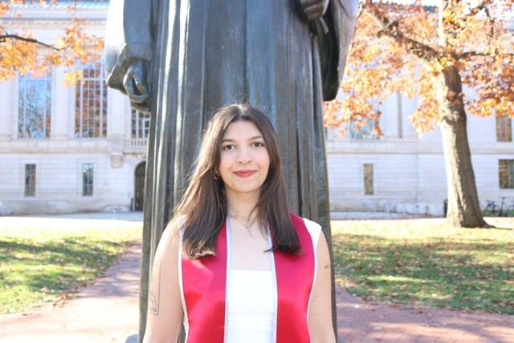
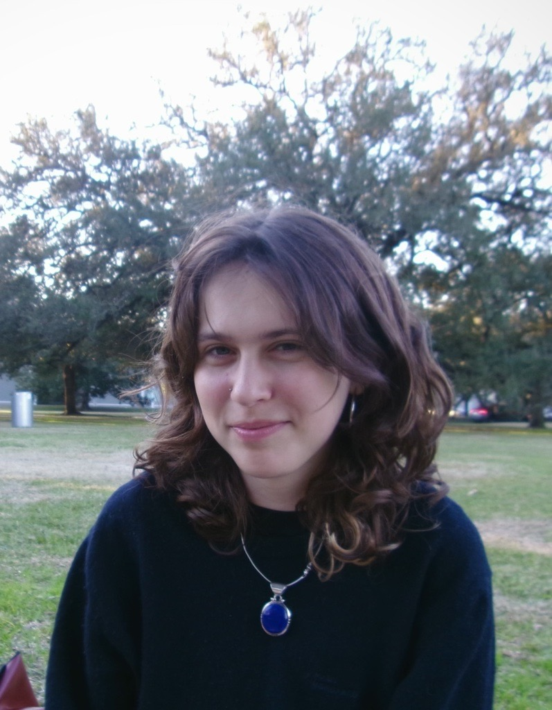
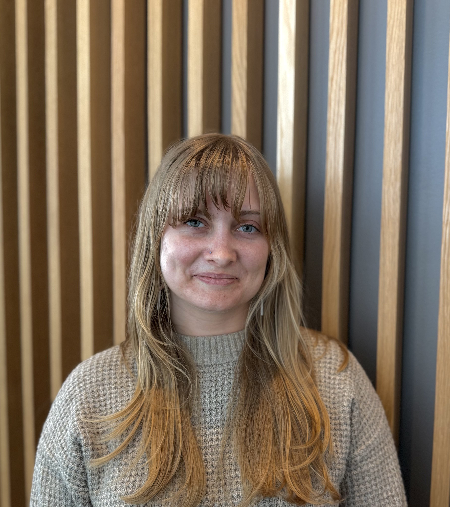
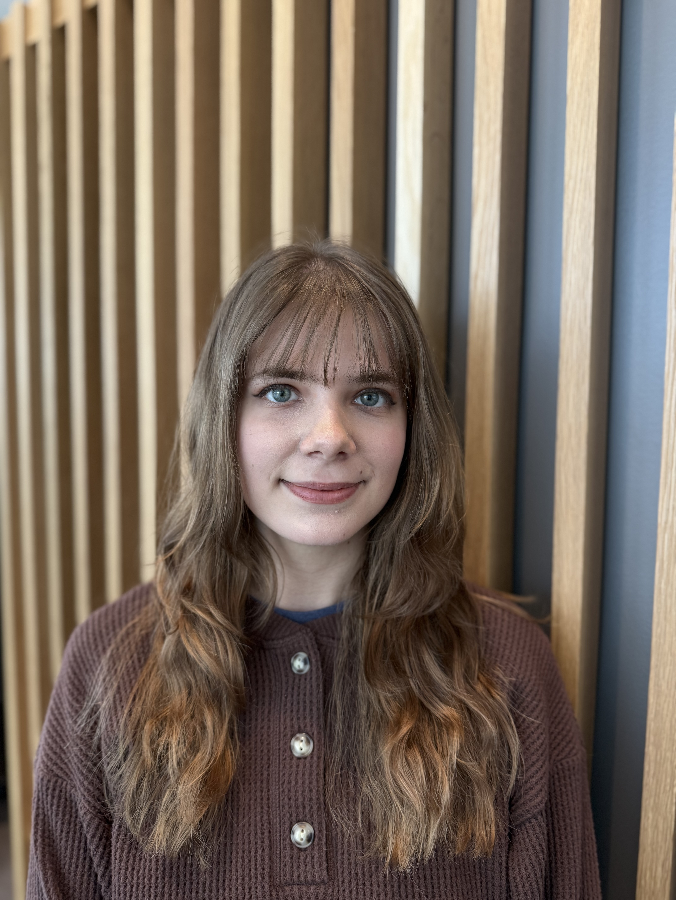
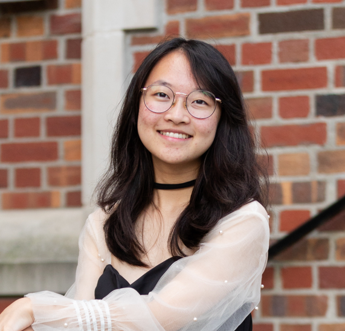
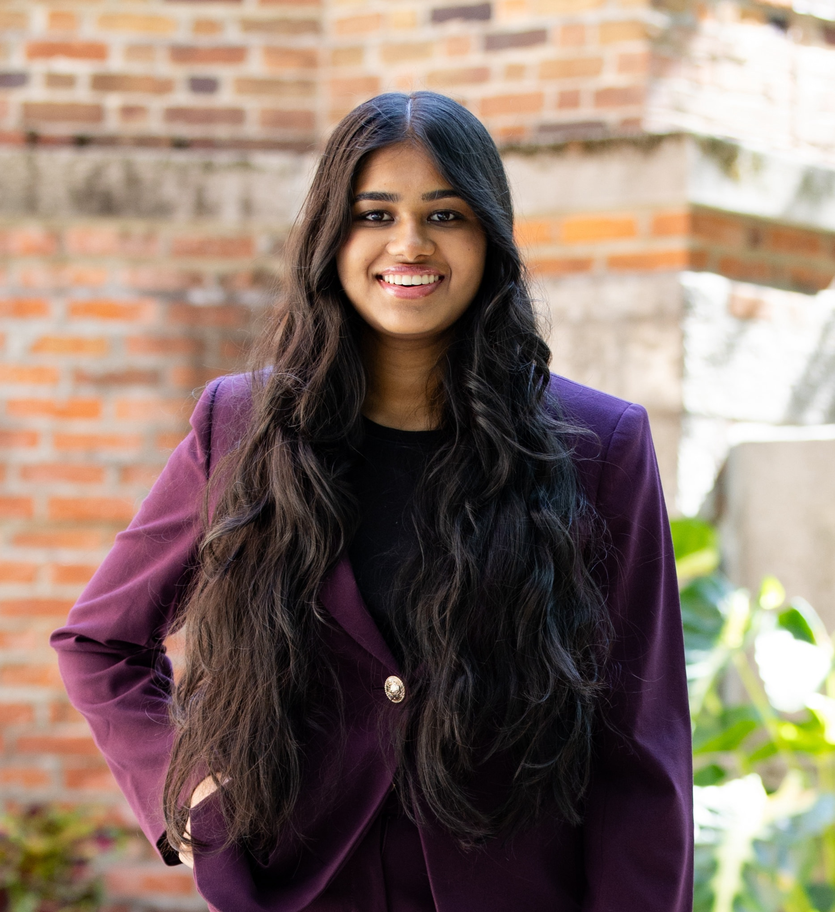

# Lab Personnel

#### **Principal Investigator**

{width="229"}

Dr. Jessica Turner

Dr. Jessica Turner is a neuroscientist who focuses on how brain imaging and behavioral data can help us better understand mental health. She’s known for bringing together teams across institutions, building tools that make large‑scale collaboration possible, and helping researchers study the brain in more open, privacy‑preserving ways. Her work has shaped how scientists combine imaging, genetics, and clinical information to gain clearer insights into psychiatric conditions. Her lab currently focuses on cerebellar structural and functional contributions to psychosis; dynamic systems applications in neuroimaging and other time series; and in collaboration with Dr. Melanie Bozzay, the application of dynamic systems methods to ecological momentary assessment (EMA) of suicide risk.

#### **Research Scientists/Postdoctoral Researchers**

{width="315"}

Dr. Mahmoud Rashidi 

Mahmoud is a research scientist in the Department of Psychiatry and Behavioral Health at The Ohio State University. His current research focuses on how the cerebellum’s structure, function, and their interaction contribute to psychotic disorders. In his free time, he enjoys reading, jogging, and cooking. 

{width="315"}

Dr. Behnoosh Shahsavaripoor 

Behnoosh is a postdoctoral research fellow at The Ohio State University, with extensive experience in clinical trials and psychiatric research. Her current work focuses on the neurobiological mechanisms of psychosis and emerging psychiatric disorders, with the goal of improving psychopharmacological treatments. She has been involved in randomized controlled trials and data analysis and has authored several peer-reviewed publications. In her free time, Behnoosh enjoys strength training, music, and movies. She has a strong interest in history and different cultures and enjoys exploring them through podcasts, museums, and travel. 

#### **Graduate Students**

{width="229"}

Kami Pearson

Kami is a PhD graduate student in The Ohio State University’s Neuroscience Graduate Program (NGP). Kami’s research focuses on understanding cerebellar contributions to cortical network organization across the psychosis spectrum. She is particularly interested in how these network alterations contribute to key disease domains, including negative and cognitive symptoms. To address these questions, she uses effective connectivity modeling to characterize circuit-level interactions. Outside of research, Kami enjoys cooking, crocheting, and reading.

{width="229"}

Zach Brodnick

Zach is a PhD graduate student in The Ohio State University’s Neuroscience Graduate Program (NGP). Currently, Zach’s research focuses on understanding the role of the cerebellum in aging, with a particular interest in how it relates to cognition and affect using structural and functional MRI. Outside the lab, Zach loves watching movies, trying new restaurants/coffee shops, traveling, and going to live sporting events and concerts. 

#### **Research Staff**

Jeremiah Byrd

Jay is a Clinical Research Assistant in the ARTIMIS study at The Ohio State University. Jay recently graduated from The Ohio State University with his bachelor’s in psychology with a focus in health and society in Fall'25. Jay is currently interested in getting his PhD in clinical pediatric psychology. His study interest deals with chronic illness in adolescents and the psychosocial consequences, more specifically how pediatric chronic pain affects the developmental process and doing psychotherapy in said population Outside of the lab, Jay enjoys reading dystopia books, Lego sets, and going out to social events.  

{width="329"}

Brianna Chakravarti

Bri is a Clinical Research Assistant for ARTEMIS and graduated from The Ohio State University with a Bachelors in Psychology and a minor in Child Abuse and Neglect. Her research interests include developing treatments for trauma-related disorders with a special interest in researching how childhood maltreatment can lead an individual to develop antisocial personality disorder (ASPD). Bri hopes to pursue either a PhD or PsyD in Clinical Psychology in the future to better serve those who have experienced trauma. Outside of work Bri loves to try new coffee shops, attend weekly farmers markets, travel, and spend time with her dog Bear!

{width="229"}

Naomi Doron

Naomi is currently a Clinical Research Assistant on the ARTEMIS study, which explores dynamic suicide risk using ecological momentary assessment methods. She graduated in 2025 from Rice University with a B.A. in Cognitive Sciences and Visual Arts. She is passionate about suicide prevention research with a focus on LGBTQ+ populations, as well as the intersection of reproductive and mental health. Naomi hopes to pursue a PhD in Clinical Psychology to continue her research explorations. Beyond the lab, she is passionate about visual arts and spends her free time between museums, parks, and tea with friends!

{width="229"}

Grace Hodges

Grace is a CRA in the Turner Lab and on the ARTEMIS project. Grace's research interests include the neuropsychological drivers of deviance and violence, as well as factors of resilience. Grace hopes to pursue a PhD in clinical psychology aligning with these interests. Outside of the lab, Grace enjoys crocheting, line and swing dancing, and spending time with her friends.

Prateek Palsule

Prateek is a Project Manager working for ARTEMIS under the umbrella of the Turner Lab. He is also in his last semester of the Master of Clinical Research (MCR) program at The Ohio State University. His research interests include exploring large scale applications of digital phenotyping and psychiatric symptoms in real world settings, along with supporting scalable mental health treatment initiatives. In his free time, he enjoys thinking about space travel, dinosaurs and aviation-along with traveling.

{width="229"}

Taylor Thompson

Taylor is a Clinical Research Assistant for ARTEMIS. She graduated from The Ohio State University with a B.A. in Psychology and a B.A. in English. She is interested in how hormones can affect mental health and also how personality disorders can affect the brain. Taylor hopes to pursue a PhD in Clinical Psychology. Outside of the lab, she likes to write and read, and she is trying to learn to play the bass guitar.

#### **Undergraduate Research Assistants**

{width="229"}

Cindy An

Cindy is an ADNiR fellow working for the Turner lab. She is earning a Bachelors in Computational Neuroscience and Psychology with a minor in statistics at The Ohio State University and will graduate in 2027. Her research interests include uncovering the neurological underpinnings of suicidal behavior and psychosis to inform development of individualized treatments. Cindy hopes to pursue a PhD in clinical psychology following these interests. In her free time, she loves making oil paintings of desserts.

{width="229"}

Diksha Chapagai

Diksha is a senior majoring in Psychology with a concentration in Neuroscience at The Ohio State University and will graduate in Spring 2026. Currently, she is completing her senior thesis examining the relationship between psychosis symptoms, childhood trauma, and cortical thickness in bipolar disorder using structural MRI data. Her research interests include understanding the neurobiological mechanisms underlying severe mental illness and how early life experiences shape the brain structure and clinical outcomes. After graduation, she plans to attend medical school. Outside of the lab, she enjoys dancing, community involvement, and spending time with friends and family.

Arushi Gupta

Arushi is an undergraduate student working on the ARTEMIS Project. She is studying Biomedical Science with a minor in Spanish at the Ohio State University and will graduate in 2028. She is interested in getting involved in research around neuroimaging and clinical-based suicide prevention research. Arushi is on the pre-med track and hopes to attend medical school after her undergrad. Outside of the lab, she is interested in dancing and traveling to new places.

{width="229"}

Deepthisri Paruchuri

Deepthisri is a first-year student from Delaware, Ohio. At Ohio State, she is majoring in neuroscience and minoring in computer science. She aspires to pursue an MD/PhD and become a physician-scientist dedicated to advancing equitable healthcare through both research and clinical care. Outside of academics, you’ll probably find her dancing or discovering a new favorite food.
